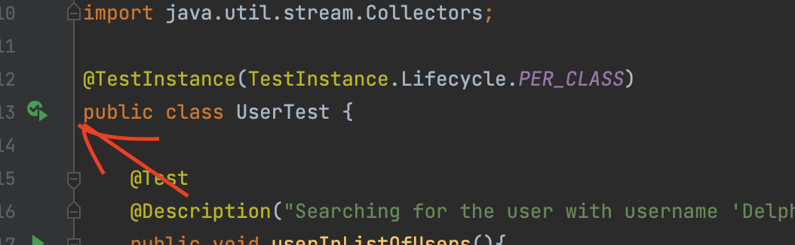
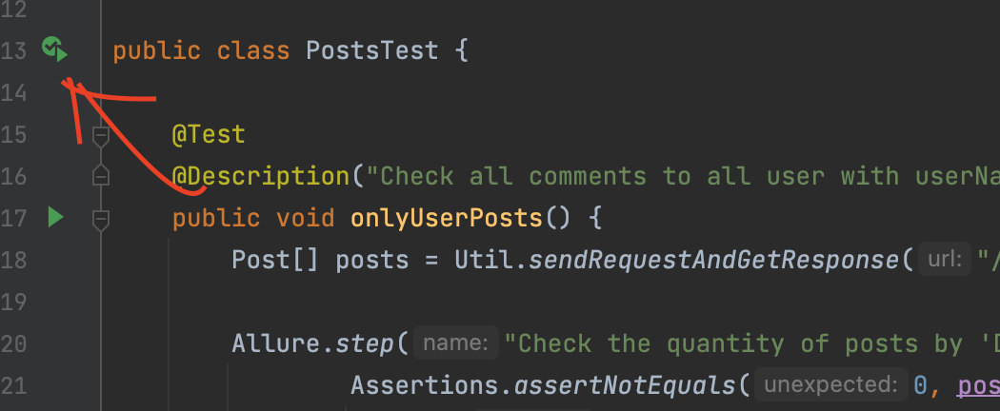
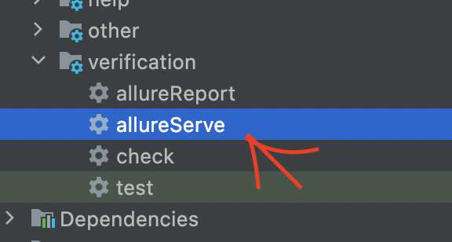
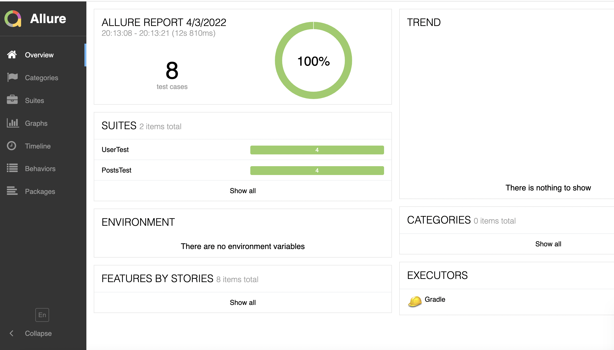
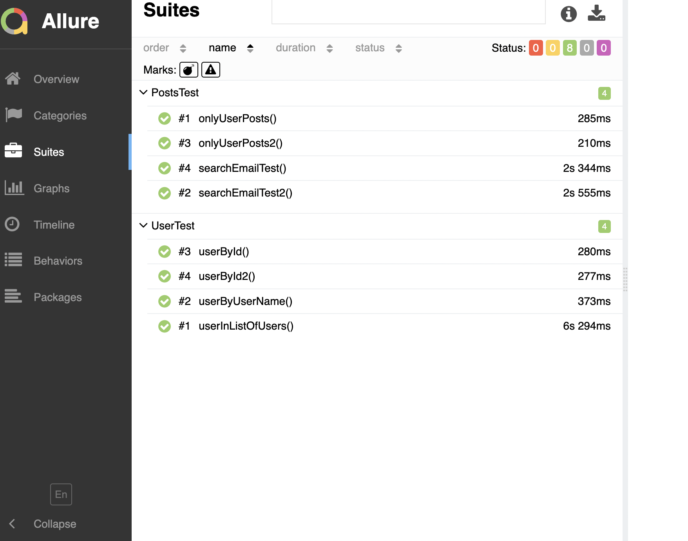
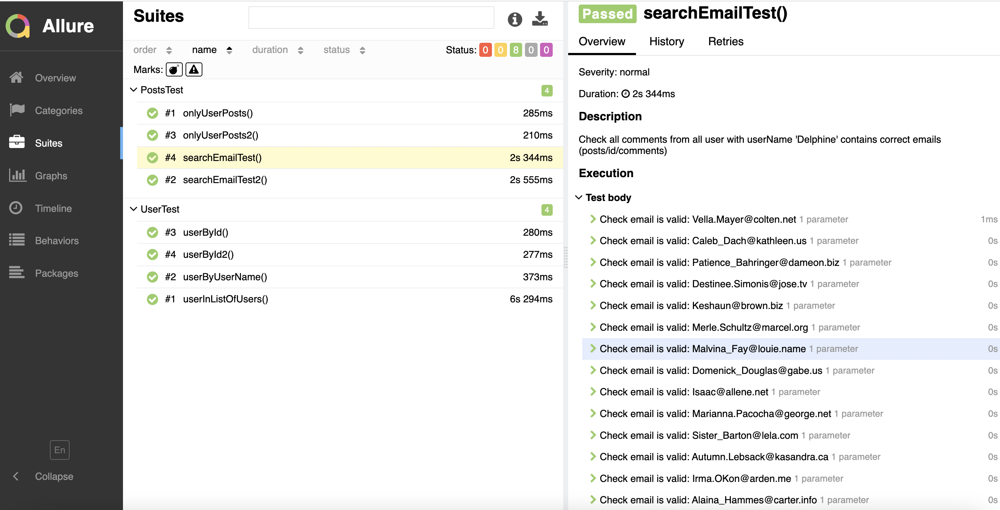

Here is the project for the test task (API)

To run tests please clone the project and press the buttons (see the screenshot below)

I've created 4 scenarios to test API connected to user and 4 - to posts.

I used Java, Rest Assured, Junit5, Allure, Gradle, Lombok plugin

After running a test/group of tests you can generate report (automatically).

Run AllureServe to look through the results with alternative instrument (screenshot below)

The screenshots of the Report below:

Allure Report overview:

Suites briefly:

One case in detail:

